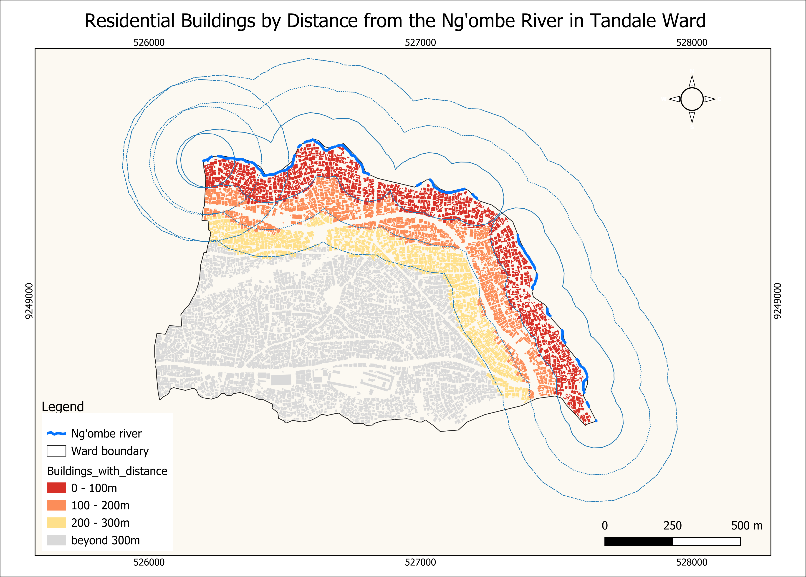

# Month 1 Summary

**Question, restated:** Which residential buildings in Tandale Ward fall within 100m, 200m, or 300m of the Ng'ombe River?

**Operation run:** A river buffer at three distances (100m, 200m, 300m) in EPSG:32737, then each building was classified by whether its centroid fell within each buffer ring. The river's two line segments were dissolved into one feature before running the distance join, to avoid duplicate results at points equidistant between segments. Buffer + spatial classification was chosen because the question is framed as distance bands, not a simple in/out flood zone, so a plain intersection wouldn't capture the tiered structure the project needs.

**What I expected:** I expected the innermost 0–100m band to hold the fewest buildings, since it's the smallest ring by area, and expected the count to grow with each wider band as more area gets included.

**What I got:**
- 0–100m: 1,287 buildings
- 100–200m: 1,090 buildings
- 200–300m: 1,057 buildings
- Beyond 300m: 4,195 buildings
- Total within 300m: 3,434 buildings (45.0% of all 7,629)
- The 300m buffer covers 46.0% of the ward's total area

**What surprised me:** My expectation was wrong. The three bands turned out close in size to each other (1,287 / 1,090 / 1,057) instead of growing with distance, even though each successive ring covers more area than the last. This means building density is highest right next to the river and thins out with distance, roughly balancing the larger ring area further out. A second finding: an earlier run of this analysis returned 7,677 buildings instead of the correct 7,629, a duplicate-count bug traced to the river's 2 separate line segments causing tied buildings to be counted twice during the distance join. Dissolving the river into one feature before joining fixed it, and this run confirms the correct total of 7,629.

**Answering the project's question:** Within Tandale Ward, 45.0% of residential buildings (3,434 of 7,629) sit within 300m of the Ng'ombe River, with the highest concentration, 1,287 buildings, in the innermost 100m band. This distance-based tier gives disaster-management and public-health teams a ranked starting point: prioritize the 0–100m band first, since it holds the most buildings in the smallest, highest-risk footprint.

**What data I still need:** The river geometry gaps flagged in Week 2/3 (unmapped breaks in the northeast) mean the buffer along those stretches is incomplete; some buildings near those gaps may be under-classified. I also still need a way to confirm which buildings in the "residential" category are genuinely occupied homes versus vacant or non-residential structures still carrying a generic OSM tag, since that affects how these counts should be read for public-health prioritisation.

See 
